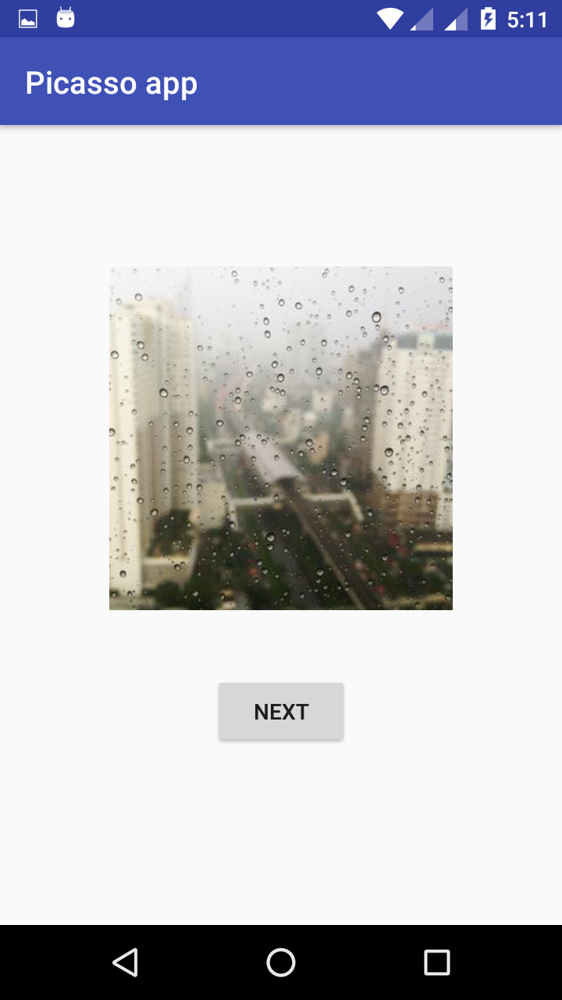

# Random Image generator app

This app generator Random Image using [Picasso](http://square.github.io/picasso/) library in android.
It also show's how to generator Number from 1 to 1000 using random api in java.

### Remember:

This app getting images from this Website - https://picsum.photos/300/300?image=145
And this website have only 1000 images.

## Screenshots:-

  

